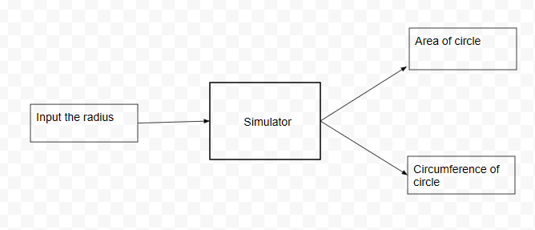

## Storyboard (Round 2)
Experiment 1: WAP to calculate the area and circumference of a circle.

### 1. Story Outline:

C Programming Language is a very first programming language for engineering students of any streams. C programming is a general purpose, procedural programming language. This language is also known as a backbone of many other programming language.

In this experiment a user want to calculate area and circumference of a circle by provind radius as a input parameter. The objective of this experiment is that a user can understand and describe basic concept of C programming.

### 2. Story:

(i) Firstly user will get the basic knowledge of C Programming and by seeing the code, they can get an idea about the experiment.
(ii) There are various keywords, functions and headerfiles are used, so user can also understand the basic tags.  
(iii)  User can get an idea about the structure of C Programming.

#### 2.1 Set the Visual Stage Description:
(i) On the simulator screen, user can see the code of experiment and basic description of the code.
(ii) There is a text box for input (Radius).
(iii) There is a dropdown list to select the unit of input.
(iv) There are three button namely Area, Circumference and Reset, by which a user can get their result.

#### 2.2 Set User Objectives & Goals:
(i) By this experiment user will be able to understand and describe the basic concept of C programming.
(ii) user will be able to understand the procedure of writing code.
(iii) user will be able to calculate the area.
(iv) user will be able to calculate the circumference.

#### 2.3 Set the Pathway Activities:

(i) When the user will click on the simulator, simulator screen will be open up.
(ii) On screen firstly there is a code section where user can get an idea abot the code and concept of C programming.
(iii) There is a text box for input (radious). User will give input for calulating area and circumference. And a dropdown list for selecting unit of input.
(iv) There are buttons on screen namely Area, Circumference and Reset, by which a user can get their result. And if user want to clear the text box section then click on reset button.

##### 2.4 Set Challenges and Questions/Complexity/Variations in Questions:

(i) What do you mean by headrfiles? What are uses of headerfile? 
(ii) Can we run a programm with using headerfiles? Explain.
(iii) Define function and its type. How many finctions are used in this code?
(iv ) What will happen if we are not using getch() funtion?
(v) Why C programming called procedural programming language?

##### 2.5 Allow pitfalls:
(i) If user does not familiar with any programming languages.
##### 2.6 Conclusion:
(i) User will take hardly 5 minutes to understand the procdedure.
(ii) It will take max. 10 minutes to complete the experiment.
(iii) User will get a basic idea and procedure to make a programm.

##### 2.7 Equations/formulas: NA
Area of circle = 3.14 * r * r
Circumference of circle = 2 * 3.14 * r
Where “r” is radius of circle.

### 3. Flowchart 4
 
link to flow chart Here : Store in the  /flowchart folder within Round2 folder in your repo
 
(guide :The lab proposer should extract logic from the story, prepare a flowchart from the story narration and write the algorithm to execute the black box.  use Google Drawings https://docs.google.com/drawings/ (send the link to your flowchart and also attach .png by exporting it )

### 4. Mindmap:

 Link to mindmap here : Store the mindmap in both .mm & .png extension in the  /mindmap folder and include link of only .pdf verison here
  
 (guide : An elaborate mind map (connecting all the points in the experiment flow ) should be prepared and submitted by the lab proposer. The mind map should be a clear and detailed document that takes into account all minute intri5acies involved in the development of virtual lab. The mindmap should be self-content and any developer across the globe should be able to code it with all those details. using only FreeMind http://freemind.sourceforge.net/wiki/index.php/Main_Page (send the .png file and also the original .mm extension project file. )

### 5. Storyboard :
Storyboard: <a href="Storyboard/carwiper.gif"> [here]</a>
Link to storybaord (.gif file ) here :
(guide: This document should include sketching and description scene wise (duration, action, description). Software to be used for storyboarding : https://wonderunit.com/storyboarder/ (Its a FOSS tool) . tutorial on how to use it https://www.youtube.com/watch?v=LAeCEpG0KX4
